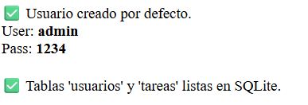

# He empezado creando el create_db

La creación de la base de datos la he echo con PDO y la e almacenado en /data con el nombre gestor_tareas.db. Tambien la base de datos utilizada va a ser SQlite.

### Parámetros de Conexión PDO

El script utiliza el modo de excepciones para el manejo de errores SQL:

| Componente                           | Descripción                                                                                          |
| :----------------------------------- | :---------------------------------------------------------------------------------------------------- |
| **`$db->setAttribute`**      | Método para cambiar la configuración de la conexión.                                               |
| **`PDO::ATTR_ERRMODE`**      | Opción que controla el "Modo de Reporte de Errores".                                                 |
| **`PDO::ERRMODE_EXCEPTION`** | Valor que activa el "Modo Excepción". Permite capturar errores SQL críticos mediante `try/catch`. |

### Entidades a utilizar

Despues de tener la conexión con la base de datos y crearla metemos las 2 entidades que se van a almacenar en este proyecto:

Usuario y Tareas

```sql
CREATE TABLE IF NOT EXISTS usuarios (
        id INTEGER PRIMARY KEY AUTOINCREMENT,
        username TEXT NOT NULL UNIQUE,
        password TEXT NOT NULL
    )
CREATE TABLE IF NOT EXISTS tareas (
        id INTEGER PRIMARY KEY AUTOINCREMENT,
        titulo TEXT NOT NULL,
        estado TEXT DEFAULT 'pendiente',
        usuario_id INTEGER,
        FOREIGN KEY (usuario_id) REFERENCES usuarios(id)
    )
```

Estas creaciones de entidades para la base de datos las insertamos en variables con el nombre de `$sqlUsuarios` y `$sqlTareas`

y usando una función de pdo lo ejecutamos com exec:

```sql
$db->exec($sqlUsuarios);
$db->exec($sqlTareas);
```

### Creación del primer usuario

Al ejecutar el create_db.php en mi proyecto no solo crea la base de datos y las entidades sino que tambien crea el primer usuario llamado admin con contraseña 1234. Esto nunca es recomendable hacerlo porque si es filtrado se podria ver tanto el usuario como contraseña en texto plano y adicionamente las contraseñas nunca se deben almacenar en texto plano sino hasheadas.

#### Paso 1 Comprobación de insertar

```php
$check = $db->query("SELECT COUNT(*) FROM usuarios")->fetchColumn();

if ($check == 0) { 
    // ... Entramos aquí solo si la tabla está vacía
}
```

Lo que realiza son 3 acciones:

1. Comprueba el numero de usuarios y te devuelve el numero
2. `fetchColumn()` al solo recibir un numero esta función de php coge directamente ese valor simple
3. El resultado de la consulta sql y el resultado recibido de fetch lo amacena en `$check`
4. Por ultimo si el valor de `$check` es igual a 0 (Es decir que no hay usuario) se entra en la condición

#### Paso 2 Seguridad y Inserción Blindada

Como seguridad vamos a hashear la contraseña con el codigo `password_Hash();`

```php
$passHash = password_hash("1234", PASSWORD_DEFAULT);
```

`password_hash` Esta función necesita un string (1234) y la convierte en una cadena larga y compleja

`PASSWORD_DEFAULT` Esto hace que php utilize un algoritmo de encriptación más seguro.

---

Ahora ya teniendo la contraseña en la variable `$passHash` podemos empezar ya a hacer la inserción. La contraseña tambien puede hacerse despues o entre esto pero asi nos quitamos futuros problemas con hashearla y no se mete tanta explicación en este apartado

```php
 $stmt = $db->prepare("INSERT INTO usuarios (username, password) VALUES (?, ?)");
        $stmt->execute(['admin', $passHash]);
```

Esta parte se divide en 2 una mas compleja que la otra:
La primer linea lo que realiza es como una sentencia preparada. Voy a añadir un usuario y contraseña que todavia no tengo. pero se almacena en `$stmt`.

El significado de las `?` es principalmente donde se van a almacenar los datos que van a ser insertados.

La segunda linea es mas simple `$stmt` ejecuta la consulta que hemos creado con anterioridad pero con los datos que le pasas en el array. En este caso le pasas en la primer posición (Nombre) admin y en la segunda posición(Contraseña) `$password` y se ejecuta para almacenarse en la base de datos.

#### Paso 3 Pequeñas comprobaciones

Esta parte no es importante porque son simplemente imprimir por pantalla los datos almacenados en la base de datos y si todo a ido bien mostraria por pantalla:

```php
echo "✅ Usuario creado por defecto.<br>";
        echo "User: <b>admin</b> <br> Pass: <b>1234</b><br><br>";
    }

    echo "✅ Tablas 'usuarios' y 'tareas' listas en SQLite.";

} catch (PDOException $e) {
    echo "❌ Error: " . $e->getMessage();
}
```



Esto de todas formas en un poryecto serio no se deberia hacer porque seria una vulnerabilidad pero he preferido ponerlo para mostrar cosas si pasa el if
